<div align="center">

# DeskHive

### A Modern AI-Powered Workplace Management Platform for iOS

[](https://swift.org)
[](https://developer.apple.com/ios/)
[](https://firebase.google.com)
[](https://openai.com)
[](LICENSE)

*DeskHive unifies employee check-ins, project collaboration, AI-powered knowledge retrieval, anonymous issue reporting, team communities, and real-time announcements into one polished iOS experience.*

</div>

---

## Table of Contents

- [Overview](#-overview)
- [Key Features](#-key-features)
- [System Architecture](#-system-architecture)
- [Tech Stack](#-tech-stack)
- [Project Structure](#-project-structure)
- [User Roles](#-user-roles)
- [Feature Deep Dives](#-feature-deep-dives)
 - [Authentication & Role-Based Navigation](#authentication--role-based-navigation)
 - [Mood-Aware Check-In](#mood-aware-check-in)
 - [AI Project Assistant (RAG)](#ai-project-assistant-rag)
 - [Project Documents & Embeddings](#project-documents--embeddings)
 - [Community Chat & Microcommunities](#community-chat--microcommunities)
 - [Task Management](#task-management)
 - [Anonymous Issue Reporting](#anonymous-issue-reporting)
 - [Announcements System](#announcements-system)
 - [Employee of the Month](#employee-of-the-month)
 - [Tech News Feed](#tech-news-feed)
- [Data Models & Firestore Schema](#-data-models--firestore-schema)
- [Prerequisites](#-prerequisites)
- [Getting Started](#-getting-started)
 - [1. Clone the Repository](#1-clone-the-repository)
 - [2. Firebase Setup](#2-firebase-setup)
 - [3. Configure API Keys](#3-configure-api-keys)
 - [4. Cloud Functions Deployment](#4-cloud-functions-deployment)
 - [5. Xcode Setup](#5-xcode-setup)
- [Environment & Secrets Management](#-environment--secrets-management)
- [Cloud Functions](#-cloud-functions)
- [Security](#-security)
- [Contributing](#-contributing)

---

## Overview

DeskHive is a **full-stack iOS workplace management application** built with SwiftUI and Firebase. It addresses the complexity of managing a modern hybrid workforce by providing role-specific dashboards for **Admins**, **Project Leads**, and **Employees** — all communicating in real time through Firestore.

What makes DeskHive stand out is its integrated **Retrieval-Augmented Generation (RAG)** pipeline: Project Leads upload `.docx` project documents that are automatically parsed, chunked, and embedded using OpenAI's `text-embedding-3-small` model. Employees can then chat with an AI assistant that grounds its answers strictly in the uploaded project context, eliminating hallucinations and surfacing accurate project knowledge instantly.

The app also features a **mood-aware UI** — when an employee checks in and logs their mood, the entire dashboard theme adapts with a personalised gradient and accent colour, making the experience feel alive and responsive to how people actually feel at work.

---

## Key Features

| Feature | Description |
|---|---|
| **Role-Based Auth** | Three distinct roles (Admin, Project Lead, Employee) with Firebase Auth and Firestore-backed role verification |
| **Mood-Aware Check-In** | Daily emotional check-in that dynamically themes the employee dashboard |
| **RAG AI Assistant** | GPT-4o-mini chat grounded on project documents via cosine-similarity retrieval |
| **Document Embedding Pipeline** | `.docx` upload → text extraction → chunking → OpenAI batch embedding → Firestore storage |
| **Community Chat** | Real-time project microcommunity messaging with Project Lead identification |
| **Task Management** | Project Leads assign prioritised tasks; employees track and mark them complete |
| **Anonymous Issue Reporting** | Zero-identity issue submission with case ID lookup and lifecycle tracking |
| **Announcements** | Broadcast and personal announcements with priority levels (Info / Warning / Urgent) |
| **Employee of the Month** | Admin-curated monthly spotlight with real-time sync across all dashboards |
| **Tech News Feed** | Live technology news via NewsAPI with in-app Safari reader |
| **Rich User Profiles** | Full profile management including department, job title, salary, bio, and avatar |
| **Cloud Functions** | Secure member creation with auto-generated credentials and welcome email dispatch |

---

## System Architecture

<div align="center">
  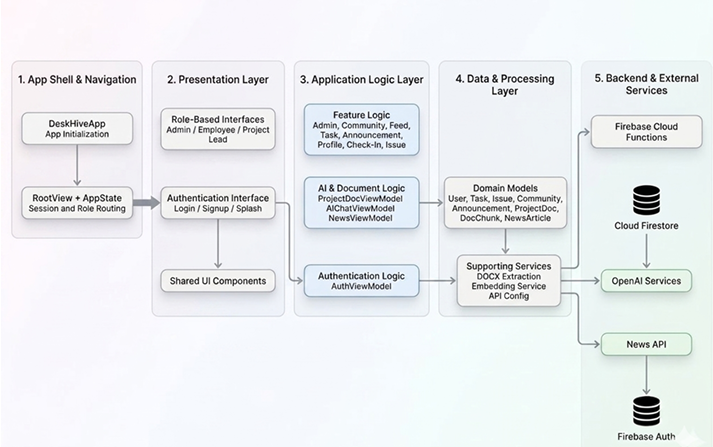
  <br/>
  <em>DeskHive system architecture — iOS client, Firebase backend, OpenAI embeddings, and Cloud Functions</em>
</div>

### System Workflow

<div align="center">
  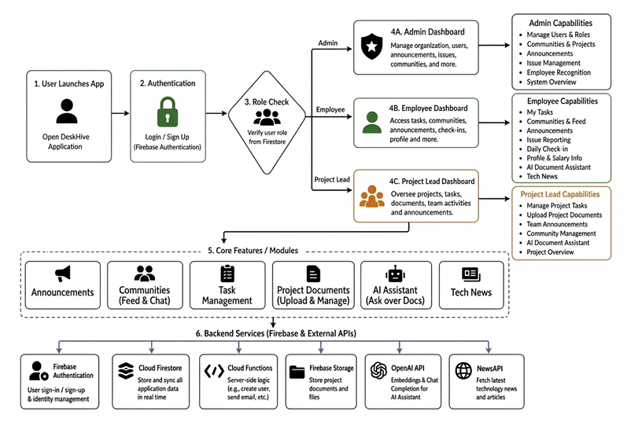
  <br/>
  <em>End-to-end system workflow — user launch, authentication, role-based routing, core features, and backend services</em>
</div>

The app follows the **MVVM pattern** throughout. Views observe `@StateObject` and `@EnvironmentObject` ViewModels, which in turn communicate with Firebase and external APIs. A single `AppState` object holds the authenticated user and current screen, enabling clean role-based routing from a central `RootView`.

---

## Tech Stack

| Layer | Technology |
|---|---|
| **UI Framework** | SwiftUI (iOS 17+) |
| **Language** | Swift 5.9 |
| **Authentication** | Firebase Authentication (Email/Password) |
| **Database** | Cloud Firestore (NoSQL, real-time) |
| **Backend Functions** | Firebase Cloud Functions (Node.js / TypeScript) |
| **AI Chat** | OpenAI `gpt-4o-mini` (streaming completions) |
| **Embeddings** | OpenAI `text-embedding-3-small` (1536 dimensions) |
| **Email** | Nodemailer + Gmail SMTP (via Cloud Functions) |
| **News** | NewsAPI.org REST API |
| **Architecture** | MVVM + `@EnvironmentObject` state propagation |
| **Async** | Swift Concurrency (`async/await`, `Task`) |
| **Secrets** | `.xcconfig` file (gitignored) |

---

## Project Structure

```
DeskHiveAlbi/
├── DeskHive/
│   ├── DeskHiveApp.swift           # App entry point, Firebase init, session restore
│   ├── ContentView.swift
│   ├── Secrets.swift               # Reads keys from xcconfig
│   ├── Secrets.xcconfig.template   # Template — copy to Secrets.xcconfig
│   ├── DeskHive.entitlements
│   ├── GoogleService-Info.plist    # Firebase config (gitignored)
│   │
│   ├── State/
│   │   └── AppState.swift          # Global navigation & current user state
│   │
│   ├── Models/
│   │   ├── UserModel.swift         # DeskHiveUser, UserRole enum
│   │   ├── ProjectDocModel.swift   # ProjectDoc, DocChunk (embedding model)
│   │   ├── NewsArticle.swift       # NewsAPI response models
│   │   └── EmployeeOfMonth.swift   # Monthly award model
│   │
│   ├── ViewModels/
│   │   ├── AuthViewModel.swift     # Sign in, sign up, session restore
│   │   ├── AdminViewModel.swift    # Member management, Cloud Function calls
│   │   ├── CheckInViewModel.swift  # Daily mood check-in logic
│   │   ├── CommunityViewModel.swift# Microcommunity CRUD & membership
│   │   ├── AIChatViewModel.swift   # RAG chat with OpenAI
│   │   ├── EmbeddingService.swift  # OpenAI embeddings (single & batch)
│   │   ├── ProjectDocViewModel.swift # Upload → embed pipeline
│   │   ├── DocxTextExtractor.swift # Client-side .docx parser
│   │   ├── TaskViewModel.swift     # Task CRUD for communities
│   │   ├── IssueReportViewModel.swift # Anonymous issue flow
│   │   ├── AnnouncementViewModel.swift# Announcements CRUD
│   │   ├── FeedViewModel.swift     # Community message feed
│   │   ├── EmployeeOfMonthViewModel.swift # Monthly award management
│   │   ├── NewsViewModel.swift     # Tech news fetching
│   │   ├── ProfileViewModel.swift  # Profile update
│   │   └── MoodQuoteProvider.swift # Mood-based motivational quotes
│   │
│   └── Views/
│       ├── SplashView.swift        # Animated launch screen
│       ├── SharedComponents.swift  # Reusable UI components
│       ├── CommunityFeedView.swift # Real-time community chat
│       ├── EmployeeOfMonthView.swift
│       ├── TechNewsView.swift
│       ├── SafariView.swift        # In-app web browser
│       ├── Auth/
│       │   ├── LoginView.swift
│       │   ├── AdminSignUpView.swift
│       │   └── EmployeeSignUpView.swift
│       ├── Admin/
│       │   ├── AdminDashboardView.swift
│       │   ├── AdminAnnouncementsView.swift
│       │   ├── AdminCommunitiesView.swift
│       │   ├── AdminIssuesView.swift
│       │   └── AddMemberSheet.swift
│       ├── Employee/
│       │   ├── EmployeeDashboardView.swift
│       │   ├── AIChatView.swift
│       │   ├── AIProjectSelectionView.swift
│       │   ├── CheckInView.swift
│       │   ├── EmployeeAnnouncementsView.swift
│       │   ├── EmployeeCommunitiesView.swift
│       │   ├── EmployeeMyWorkView.swift
│       │   ├── EmployeeProfileView.swift
│       │   ├── IssueReportView.swift
│       │   └── MyIssuesView.swift
│       └── ProjectLead/
│           ├── ProjectLeadDashboardView.swift
│           ├── ProjectLeadTasksView.swift
│           ├── ProjectLeadAnnouncementsView.swift
│           └── ProjectDocUploadView.swift
│
├── functions/
│   ├── src/index.ts                # Cloud Functions (createMember, welcome email)
│   ├── package.json
│   └── tsconfig.json
│
├── firebase.json
├── firestore.rules                 # Firestore security rules
├── firestore.indexes.json
├── SETUP.md
└── Images/                         # Screenshots and diagrams
```

---

## User Roles

DeskHive enforces three distinct roles, each with a dedicated dashboard and set of permissions:

### Admin
The Admin is the super-user of the organisation. Admins can:
- **Create members** — invoke a Cloud Function that generates a secure random password, creates a Firebase Auth account, and emails credentials to the new employee
- **Manage communities** — create and configure project microcommunities, assign Project Leads
- **Broadcast announcements** — send Info / Warning / Urgent announcements to all employees or specific individuals
- **Review issues** — see all anonymously submitted workplace issues and update their status
- **Award Employee of the Month** — select a winner and publish their spotlight to all dashboards
- **View the tech news feed** and full profile management

### Project Lead
Elevated from an employee account by the Admin. Project Leads can:
- **Own a community** — each lead is assigned to exactly one project microcommunity
- **Upload project documents** — `.docx` files are parsed and embedded into Firestore for AI retrieval
- **Assign and track tasks** — create tasks with priority and deadline, assign to team members
- **Chat in the community feed** — identified with a crown badge
- **Use the AI assistant** — chat with the RAG assistant grounded on their project docs
- **Submit and track issues** — same anonymous reporting capability as employees
- **View announcements** and manage profile

### Employee
Standard workspace member. Employees can:
- **Daily mood check-in** — log how they're feeling; the dashboard theme adapts accordingly
- **View their work** — see tasks assigned to them by the Project Lead
- **Chat in community feeds** — real-time group messaging within their project communities
- **Use the AI assistant** — ask questions about project documents in their communities
- **Submit anonymous issues** — zero-identity workplace concern reporting
- **Track issue status** — look up case by case ID
- **Read announcements** — personal and broadcast messages from Admin
- **View Employee of the Month** spotlight
- **Browse tech news** and manage profile

---

## Feature Deep Dives

### Authentication & Role-Based Navigation

```
SplashView (2.8s) → LoginView → Firestore role lookup
                                    ├── admin       → AdminDashboardView
                                    ├── projectLead → ProjectLeadDashboardView
                                    └── employee    → EmployeeDashboardView
```

`AppState` is the single source of truth for navigation. After Firebase Auth resolves, `AuthViewModel.restoreSession()` fetches the user document from Firestore, constructs a `DeskHiveUser`, and calls `appState.navigateAfterLogin(user:)` — which sets `currentScreen` to the correct dashboard. All role guards are enforced both client-side (routing) and server-side (Firestore security rules + Cloud Function auth checks).

---

### Mood-Aware Check-In

<table>
  <tr>
    <td align="center"><b>Before Check-In</b><br/><em>Default dark theme</em></td>
    <td align="center"><b>After Check-In — "Great" mood</b><br/><em>Emerald green theme applied</em></td>
  </tr>
  <tr>
    <td>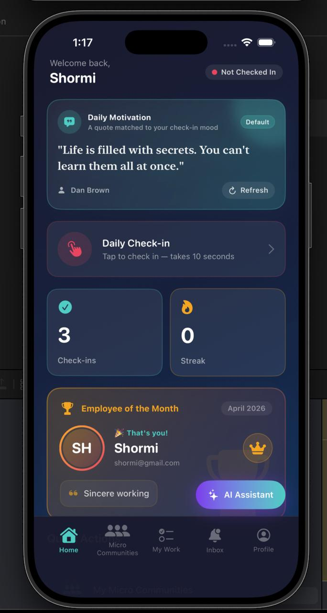</td>
    <td>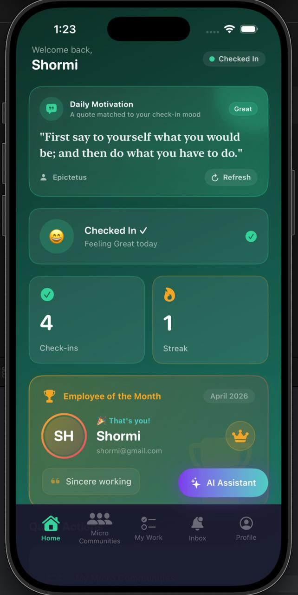</td>
  </tr>
</table>

Each workday, employees open the **Check In** sheet and select their current mood from five states:

| Mood | Emoji | Dashboard Theme |
|---|---|---|
| Great | | Emerald green gradient |
| Good | | Ocean teal gradient |
| Okay | | Warm amber gradient |
| Low | | Muted blue gradient |
| Stressed | | Deep purple gradient |

The selected mood is stored in Firestore under `checkIns/{uid}_{date}`. On subsequent app opens the same day, `CheckInViewModel` detects the existing record and pre-loads the mood, applying the theme immediately. The check-in status pill in the top bar turns the accent colour when checked in.

> Mood data uses a UID that is stored in Firestore but never surfaced to Admin, preserving anonymity at the data layer.

---

### AI Project Assistant (RAG)

<div align="center">
  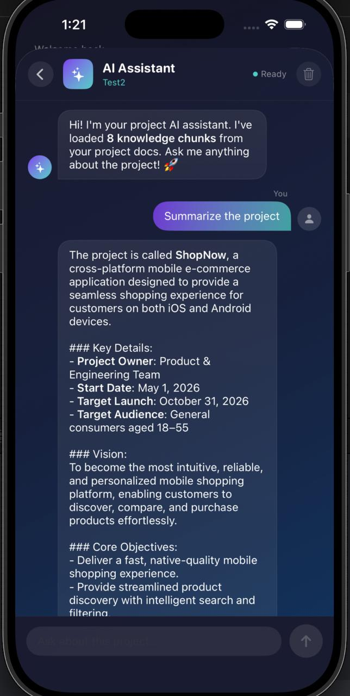
</div>

DeskHive's AI assistant uses **Retrieval-Augmented Generation** to answer questions strictly from project documentation:

1. **Load** — `AIChatViewModel.loadChunks()` fetches all embedded `DocChunk` records for the selected community from Firestore.
2. **Embed query** — The user's message is sent to OpenAI `text-embedding-3-small` to produce a 1536-dimensional query vector.
3. **Rank** — Cosine similarity is computed between the query vector and every stored chunk vector. The top **K=6** chunks are selected as context.
4. **Complete** — A `gpt-4o-mini` chat completion is constructed with the retrieved chunks injected as a system message. The reply streams back token by token to the UI.

If no documents have been uploaded yet, the assistant informs the user and prompts the Project Lead to upload docs first. HTTP 401 errors produce a specific "invalid API key" message rather than a generic error.

---

### Project Documents & Embeddings

<div align="center">
  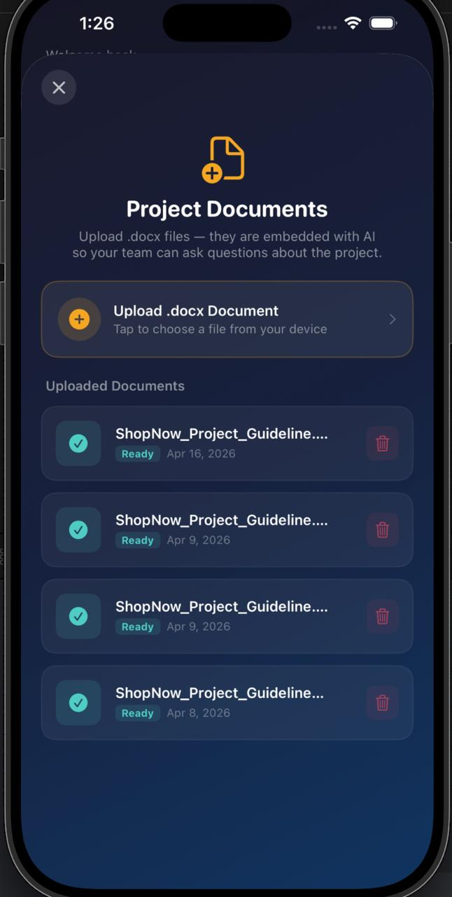
</div>

The full document pipeline (all client-side, no additional backend required):

```
User picks .docx file
        │
        ▼
DocxTextExtractor.extractText(from:)
  (unzips .docx, parses word/document.xml)
        │
        ▼
Split into ~500-token chunks with 50-token overlap
        │
        ▼
EmbeddingService.embedBatch(texts:)
  → POST /v1/embeddings  (text-embedding-3-small)
  → batches of up to 2048 strings per OpenAI limit
        │
        ▼
Write to Firestore:
  communities/{id}/projectDocs/{docID}           ← metadata
  communities/{id}/projectDocs/{docID}/chunks/*  ← DocChunk records
        │
        ▼
Mark document status = "ready"
```

Documents are stored with base64-encoded raw bytes in Firestore so they can be re-processed if needed. Progress is reported live via `uploadProgress: String` published by `ProjectDocViewModel`.

---

### Community Chat & Microcommunities

<div align="center">
  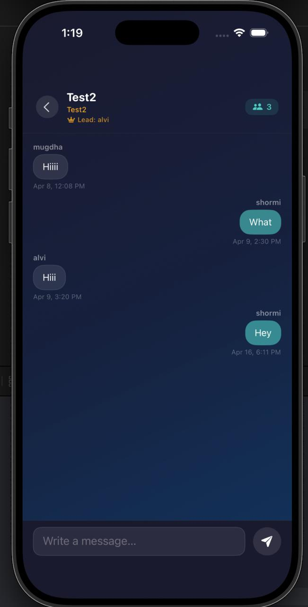
</div>

Each project has a **Microcommunity** — a named group with a description, a project tag, a list of member UIDs/emails, and an assigned Project Lead. Communities are created and managed by the Admin.

Inside a community, members can:
- Send real-time messages via `CommunityFeedView` (Firestore listener)
- See the Project Lead identified with a crown badge and gold label
- View the member count

The AI assistant is also scoped per community — employees select their community in `AIProjectSelectionView` before entering the chat, ensuring the assistant only has access to that project's documents.

---

### Task Management

<div align="center">
  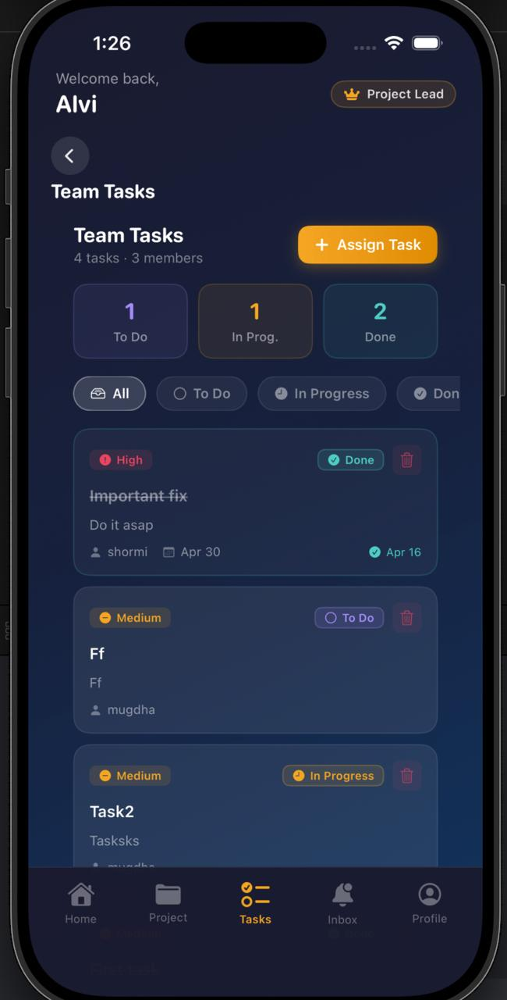
</div>

Tasks live at `communities/{communityID}/tasks/{taskID}` in Firestore.

**Project Lead capabilities:**
- Create tasks with a title, description, priority (Low / Medium / High), and deadline
- Assign to any community member by email
- Delete tasks
- View task progress summary (To Do / In Progress / Done counts)

**Employee capabilities:**
- View tasks assigned to them in `EmployeeMyWorkView`
- Update task status (To Do → In Progress → Done)

Tasks use real-time Firestore listeners so status updates appear instantly across devices.

---

### Anonymous Issue Reporting

<table>
  <tr>
    <td align="center">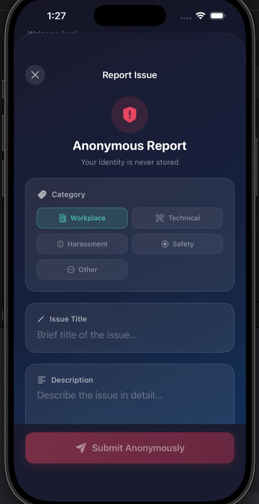</td>
    <td align="center">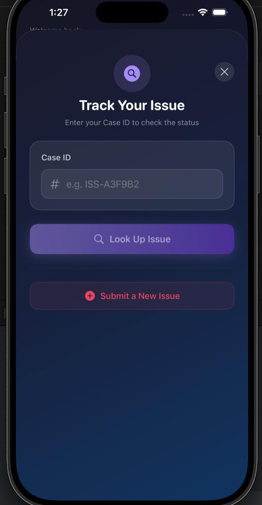</td>
  </tr>
  <tr>
    <td align="center"><em>Submit anonymously</em></td>
    <td align="center"><em>Track by Case ID</em></td>
  </tr>
</table>

Employees can report workplace concerns across five categories:

| Category | Use Case |
|---|---|
| Workplace | Office environment, policies |
| Technical | IT, equipment, software |
| Harassment | Interpersonal conduct |
| ⊕ Safety | Physical hazards |
| ⋯ Other | Anything else |

When submitted, a **Case ID** (e.g. `ISS-A3F9B2`) is generated. The submitter's identity is **never stored** in the issue document. Employees can later look up their case by ID to check:

- Current status: `Open` → `In Review` → `Resolved`
- Admin notes or updates

The Admin sees all issues in `AdminIssuesView` and can update statuses and add responses.

---

### Announcements System

<div align="center">
  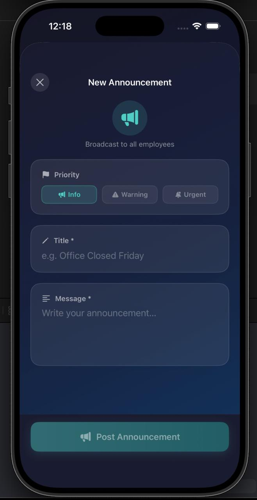
</div>

The Admin can create two types of announcements:

| Type | Target | Description |
|---|---|---|
| **Broadcast** | All employees | Company-wide news, policy changes, events |
| **Personal** | Specific UID | Promotions, individual recognition |

Each announcement has a **priority level**:
- **Info** — teal accent, routine communication
- **Warning** — amber accent, requires attention
- **Urgent** — red accent, immediate action needed

Project Leads can also send task-related announcements to assignees. Employees see their personalised inbox combining broadcasts and personal messages, sorted newest-first.

---

### Employee of the Month

The Admin selects a winner from the active employee roster, adds a reason, and publishes the award. The document is stored at `employeeOfMonth/{yyyy-MM}` — a single document per month.

All three dashboards (Admin, Project Lead, Employee) subscribe to this document via a real-time Firestore listener (`EmployeeOfMonthViewModel.startListening()`). When the Admin saves a new winner, every connected device updates instantly with the spotlight card. If the logged-in user is the winner, their card is highlighted with a special border and celebration indicator.

History is maintained for the last 6 months and shown in the Admin view.

---

### Tech News Feed

The `NewsViewModel` fetches the latest technology articles from **NewsAPI.org**, filtering for software, programming, and developer content. Articles with removed/empty titles are filtered out. Tapping an article opens it in `SafariView` (an in-app `SFSafariViewController` wrapper) for a seamless reading experience without leaving the app.

---

## Data Models & Firestore Schema

### Entity Relationship Diagram

<div align="center">
  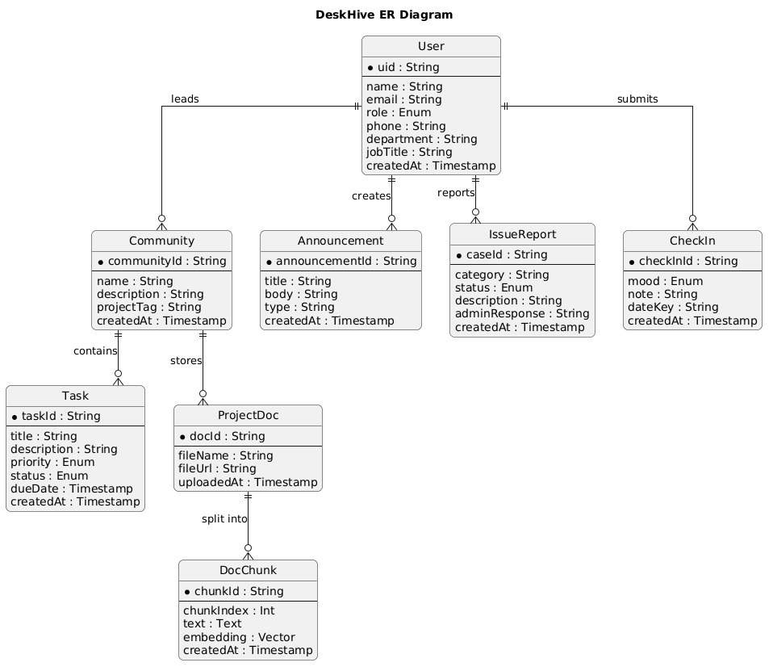
</div>

### Top-Level Collections

```
Firestore
├── users/{uid}
│   ├── email, role, createdAt
│   ├── fullName, phone, department, jobTitle
│   ├── profileImageURL, salary, bio
│
├── checkIns/{uid_date}
│   ├── uid, mood, note, timestamp
│
├── communities/{communityID}
│   ├── name, description, project
│   ├── memberIDs[], memberEmails[]
│   ├── projectLeadID, projectLeadEmail, createdAt
│   │
│   ├── projectDocs/{docID}
│   │   ├── fileName, uploadedBy, uploadedAt, status, base64Data
│   │   └── chunks/{chunkID}
│   │       ├── id, text, embedding[1536], chunkIndex
│   │
│   ├── tasks/{taskID}
│   │   ├── title, description, priority, status
│   │   ├── assignedToID, assignedToEmail
│   │   ├── dueDate, completedAt, createdAt
│   │
│   └── messages/{messageID}
│       ├── senderID, senderEmail, text, createdAt
│
├── announcements/{announcementID}
│   ├── title, body, priority, type
│   ├── targetUID (empty = broadcast), createdAt
│
├── issues/{issueID}
│   ├── caseID, category, title, description
│   ├── status, adminNote, createdAt
│   (NO user identity stored)
│
└── employeeOfMonth/{yyyy-MM}
    ├── employeeID, employeeEmail, employeeName
    ├── reason, awardedBy, awardedAt, month
```

### Key Models

| Swift Model | Firestore Path | Description |
|---|---|---|
| `DeskHiveUser` | `users/{uid}` | All user profile data + role |
| `Microcommunity` | `communities/{id}` | Project group with members |
| `CommunityTask` | `communities/{id}/tasks/{id}` | Task with priority and assignee |
| `ProjectDoc` | `communities/{id}/projectDocs/{id}` | Uploaded document metadata |
| `DocChunk` | `.../projectDocs/{id}/chunks/{id}` | Embedded text chunk (1536-dim vector) |
| `DailyCheckIn` | `checkIns/{uid_date}` | Mood entry per user per day |
| `Announcement` | `announcements/{id}` | Broadcast or personal message |
| `IssueReport` | `issues/{id}` | Anonymous workplace concern |
| `EmployeeOfMonth` | `employeeOfMonth/{yyyy-MM}` | Monthly award winner |

---

## Prerequisites

Before you begin, ensure you have the following installed and configured:

- **macOS 14 (Sonoma)** or later
- **Xcode 15.2** or later
- **iOS 17.0+** deployment target (physical device or simulator)
- **Node.js 18+** and **npm** (for Firebase Cloud Functions)
- **Firebase CLI** (`npm install -g firebase-tools`)
- A **Firebase project** with Firestore, Authentication, and Functions enabled
- An **OpenAI API key** with access to `text-embedding-3-small` and `gpt-4o-mini`
- A **NewsAPI.org API key**
- A **Gmail account** with an [App Password](https://myaccount.google.com/apppasswords) (for welcome emails)

---

## Getting Started

### 1. Clone the Repository

```bash
git clone https://github.com/your-org/DeskHive.git
cd DeskHive
```

### 2. Firebase Setup

1. Go to [Firebase Console](https://console.firebase.google.com) and create a new project.
2. Enable **Authentication** → Email/Password sign-in method.
3. Enable **Cloud Firestore** → Start in Production mode.
4. Enable **Cloud Functions**.
5. In **Project Settings → Your apps**, add an **iOS app** with bundle ID `com.yourorg.DeskHive`.
6. Download `GoogleService-Info.plist` and place it at `DeskHive/GoogleService-Info.plist`.

> **Note:** `GoogleService-Info.plist` is gitignored. Never commit it to version control.

Deploy Firestore security rules:

```bash
firebase login
firebase use --add   # select your Firebase project
firebase deploy --only firestore:rules,firestore:indexes
```

### 3. Configure API Keys

Copy the secrets template and fill in your values:

```bash
cp DeskHive/Secrets.xcconfig.template DeskHive/Secrets.xcconfig
```

Edit `Secrets.xcconfig`:

```
OPENAI_API_KEY = sk-your-openai-key-here
```

> **Note:** `Secrets.xcconfig` is gitignored. The `Secrets.swift` file reads this value at build time via the Info.plist / xcconfig bridge. Never hardcode API keys in Swift source files.

For the **NewsAPI key**, it is currently set directly in `NewsViewModel.swift`. For production, move it to the same xcconfig mechanism.

### 4. Cloud Functions Deployment

Install dependencies and deploy:

```bash
cd functions
npm install
npm run build          # compiles TypeScript → lib/
cd ..
```

Set Gmail credentials as Firebase environment config:

```bash
firebase functions:config:set \
  gmail.user="yourapp@gmail.com" \
  gmail.app_password="your-16-char-app-password"
```

Deploy functions:

```bash
firebase deploy --only functions
```

The `createMember` callable function will now be available to the iOS app.

### 5. Xcode Setup

1. Open `DeskHive.xcodeproj` in Xcode.
2. Add Firebase iOS SDK via **Swift Package Manager**:
 - **File → Add Package Dependencies**
 - URL: `https://github.com/firebase/firebase-ios-sdk`
 - Add targets: `FirebaseAuth`, `FirebaseFirestore`, `FirebaseFunctions`
3. Ensure `Secrets.xcconfig` is referenced in the project's build configuration:
 - Select the project in navigator → **Info** tab → **Configurations**
 - Set both Debug and Release to use `Secrets.xcconfig`
4. Select your development team in **Signing & Capabilities**.
5. Build and run on a simulator or device (iOS 17.0+).

---

## Environment & Secrets Management

| Secret | Location | How It's Used |
|---|---|---|
| `OPENAI_API_KEY` | `Secrets.xcconfig` (gitignored) | Read by `Secrets.swift`, used by `EmbeddingService` and `AIChatViewModel` |
| `GoogleService-Info.plist` | Root of `DeskHive/` (gitignored) | Firebase SDK configuration |
| `gmail.user` / `gmail.app_password` | Firebase Functions config | Nodemailer SMTP auth in `createMember` function |
| NewsAPI key | `NewsViewModel.swift` | Fetching tech articles (move to xcconfig for production) |

The `.gitignore` at root excludes:
- `Secrets.xcconfig`
- `GoogleService-Info.plist`
- `functions/.env`
- `node_modules/`

---

## Cloud Functions

### `createMember` (HTTPS Callable)

**Location:** `functions/src/index.ts`

**Trigger:** Called from `AdminViewModel` via `FirebaseFunctions` SDK when an Admin adds a new team member.

**Flow:**
1. Verifies the caller is authenticated and has the `admin` role in Firestore.
2. Generates a cryptographically secure random 6-character password using `crypto.randomBytes`.
3. Creates a Firebase Auth user with the provided email and generated password.
4. Writes a `users/{uid}` document to Firestore with `role: "employee"`.
5. Sends a welcome email via Nodemailer/Gmail containing login credentials.
6. Returns `{ success: true, uid }` to the iOS caller.

**Input:**
```json
{ "email": "newemployee@company.com" }
```

**Output:**
```json
{ "success": true, "uid": "firebase-uid-string" }
```

**Security:** Unauthenticated calls and calls from non-admin users are rejected with `HttpsError("unauthenticated")` and `HttpsError("permission-denied")` respectively.

---

## Security

DeskHive implements defence-in-depth at multiple layers:

### Firestore Security Rules
- Documents in `users/` can only be read/written by the owning UID or admin-role users
- `issues/` documents are write-once from authenticated users; the writer's identity is never stored in the document itself
- Community sub-collections are scoped to community members only

### Cloud Functions
- Every callable function verifies `context.auth` before processing
- Role checks are performed against Firestore, not client-supplied claims
- Passwords are generated with `crypto.randomBytes` (CSPRNG), not `Math.random`

### Client-Side
- API keys are loaded from an `.xcconfig` file that is gitignored and never embedded in source
- No secrets appear in the git history
- Firebase session tokens are managed by the Firebase SDK and stored in the iOS Keychain

### Privacy
- Anonymous issue reports contain no user-identifying information in the stored document
- Mood check-in UIDs are stored but never surfaced in Admin views

---

## Contributing

1. **Fork** the repository and create a feature branch: `git checkout -b feature/your-feature`
2. Follow the existing **MVVM** pattern — new features belong in a ViewModel, not a View.
3. Keep API keys out of source — use `Secrets.xcconfig` for any new secrets.
4. Test on both iPhone and iPad simulators before submitting.
5. Open a **Pull Request** with a clear description of the change and screenshots if UI is affected.

---

## License

This project is licensed under the MIT License. See the [LICENSE](LICENSE) file for details.

